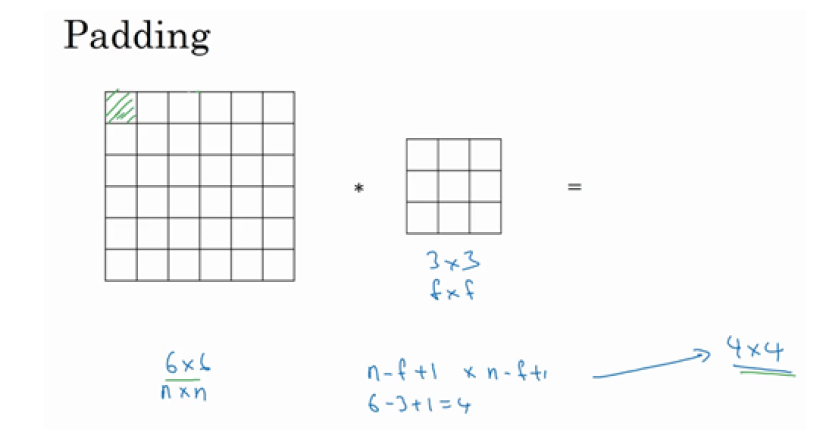

# Convolutional-Neural-Networks
作业实现：卷积神经网络部分

| 序号 | 项目名称 |                             备注                             |
| :--: | :------: | :----------------------------------------------------------: |
|  1   |  Week1   | 卷积神经网络 (Foundations of Convolutional Neural Networks)  |
|  2   |  Week2   | 深度卷积网络：实例探究 (Deep convolutional models: case studies) |
|  3   |  Week3   |                 目标检测 (Object detection)                  |
|  4   |  Week4   | 特殊应用：人脸识别和神经风格转换 (Special applications: Face recognition &Neural style transfer) |

------

## 1 卷积神经网络

### 1.1 Padding

🌱 **关键点：**

- 卷积是指做元素乘积求和；
- 图像矩阵大小n×n，过滤器大小f×f，则，输出的维度 = (n-f+1)×(n-f+1)；
- 如上图所示常规的卷积操作有两个缺点：1）输出会缩小；2）图像边缘的大部分信息都丢失了；
- 为解决常规卷积操作的缺点，我们可以在图像边缘再填充一层像素，填充数量为p，则，输出的维度 = (n+2p-f+1)×((n+2p-f+1)；
- 常见的两种卷积方法：Valid卷积和Same卷积；
  - Valid卷积指不填充；
  - Same卷积指填充后，输出大小和输入大小一致；

### 1.2 卷积步长

🌱 **关键点：**

- 假设用一个f×f的过滤器卷积一个n×n的图像，padding为p，步幅为s，则输出为：

$$
[\frac{n+2p-f}{s}+1]×[\frac{n+2p-f}{s}+1]
$$

注：若商不是整数，则需要进行向下取整

### 1.3 单层卷积网络

🌱 **关键点：**

- 
